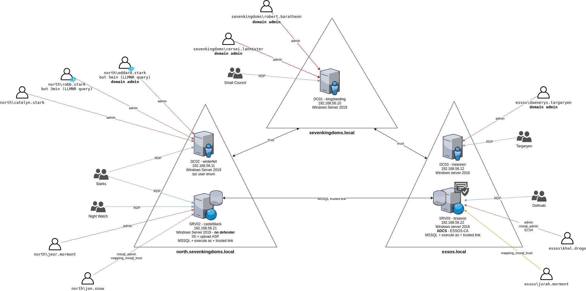

# GOAD (Game Of Active Directory) - version 2


## Description
GOAD is a pentest active directory LAB project.
The purpose of this lab is to give pentesters a vulnerable Active directory environment ready to use to practice usual attack techniques.

## warning
This lab is extremely vulnerable, do not reuse recipe to build your environment and do not deploy this environment on internet (this is a recommendation, use it as your own risk)
This repository is for pentest practice only.

## licenses
This lab use free windows VM only (180 days). After that delay enter a license on each server or rebuild all the lab (may be it's time for an update ;))

## Installation

- Installation is in two parts :

1. providing : it is made with vagrant, it download and run empty windows box.
2. provisioning : it is made with ansible, it will install all the stuff to make the lab running like an active directory network

### tldr;

- You are on linux, you already got virtualbox, vagrant and docker installed on your host and you know what you are doing, just run :

```bash
# providing (create and start the vms)
vagrant up
# provisioning (setup the goad config and install inside the vms)
sudo docker build -t goadansible .
sudo docker run -ti --rm --network host -h goadansible -v $(pwd):/goad -w /goad/ansible goadansible ansible-playbook main.yml
```

- Now you can grab a coffee it will take time :)

### Windows users warning

- The lab intend to be installed from a **Linux host** and was tested only on this.
- Some people have successfully installed the lab on a windows OS, to do that they create the VMs with vagrant and have done the ansible provisioning part from a linux machine.
- In this case the linux machine used to do the provisioning must be setup with one adapter on NAT and one adapter on the same virtual private network as the lab.

### 1. - Create the VMs with Vagrant

> Vagrant+virtualbox or Vagrant+vmware are used to provide the virtual machines and Ansible is use to automate the configuration and vulnerabilities setup.

- The first step of the installation is to create the VMs.
- To do that vagrant will be in charge of the creation on the provider you choose.

#### 1.1 - Choose the provider between virtualbox and vmware-workstation and install it

- This is up to you, the lab is by default setup on virtualbox (because it is free) but you can choose vmware-workstation if you want (just follow this guide to do the rights changes)

#### Install with Virtualbox

- **virtualbox** actually the vms are provided to be run on virtualbox so you need a working virtualbox environment on your computer.
- This is obvious but yes you need to first install it on your hosts if you want to use it. (on ubuntu `sudo apt install virtualbox` will to the work)
- If you choose virtualbox, nothing to change on the files, this is the default environment.

#### OR install with Vmware workstation (aka "Virtualbox c'est no way")

- Download and install vmware workstation and set your license key (or use the 30 days trial) [workstation-pro-evaluation](https://www.vmware.com/products/workstation-pro/workstation-pro-evaluation.html)
- __Note that workstation-player can't manage clone and snapshot and will not work with vagrant you need to use the pro version__
- You will also need to install VMware Utility driver (https://developer.hashicorp.com/vagrant/downloads/vmware)
(an install guide can be found here : https://developer.hashicorp.com/vagrant/docs/providers/vmware/vagrant-vmware-utility)

```bash
cd /tmp
wget https://releases.hashicorp.com/vagrant-vmware-utility/1.0.21/vagrant-vmware-utility_1.0.21_linux_amd64.zip
sudo mkdir -p /opt/vagrant-vmware-desktop/bin
sudo unzip -d /opt/vagrant-vmware-desktop/bin vagrant-vmware-utility_1.0.21_linux_amd64.zip
sudo /opt/vagrant-vmware-desktop/bin/vagrant-vmware-utility certificate generate
sudo /opt/vagrant-vmware-desktop/bin/vagrant-vmware-utility service install
```

- Note that you will need to install the vmware-desktop plugin after the vagrant installation : 
```
vagrant plugin install vagrant-vmware-desktop
```

- **For vmware you need to make changes to the Vagrantfile and the hosts file**

- `Vagrantfile`:
  - Change the following lines from this :
```
# Uncomment this depending on the provider you want to use
ENV['VAGRANT_DEFAULT_PROVIDER'] = 'virtualbox'
# ENV['VAGRANT_DEFAULT_PROVIDER'] = 'vmware_desktop'
```

  - To this :
```
# Uncomment this depending on the provider you want to use
# ENV['VAGRANT_DEFAULT_PROVIDER'] = 'virtualbox'
ENV['VAGRANT_DEFAULT_PROVIDER'] = 'vmware_desktop'
```

- `ansible/hosts`:
  - Change the following lines from this :
```
; adapter created by vagrant and virtualbox
nat_adapter=Ethernet
domain_adapter=Ethernet 2

; adapter created by vagrant and vmware
; nat_adapter=Ethernet0
; domain_adapter=Ethernet1
```
 - To this:
```
; adapter created by vagrant and virtualbox
; nat_adapter=Ethernet
; domain_adapter=Ethernet 2

; adapter created by vagrant and vmware
nat_adapter=Ethernet0
domain_adapter=Ethernet1
```

#### 1.2 - Install Vagrant

- **vagrant** from their official site [vagrant](https://developer.hashicorp.com/vagrant/downloads). __The version you can install through your favorite package manager (apt, yum, ...) is probably not the latest one__.
- Install vagrant plugin vbguest if you want the guest addition: `vagrant plugin install vagrant-vbguest` (not mandatory)
- Vagrant installation is well describe in [the official vagrant page](https://developer.hashicorp.com/vagrant/downloads) (tests are ok on 2.3.4)

```bash
wget -O- https://apt.releases.hashicorp.com/gpg | gpg --dearmor | sudo tee /usr/share/keyrings/hashicorp-archive-keyring.gpg
echo "deb [signed-by=/usr/share/keyrings/hashicorp-archive-keyring.gpg] https://apt.releases.hashicorp.com $(lsb_release -cs) main" | sudo tee /etc/apt/sources.list.d/hashicorp.list
sudo apt update && sudo apt install vagrant
```

#### 1.3 - Create the vms

- To create the VMs just run 

```bash
vagrant up
```

- For each vm, it will download the box and than install it on your provider.
- If you get an issue on this, this is certainly due to vagrant or your provider (but in this case just take a look to at the github issue and on discord maybe someone got the same issue)

- At the end of the vagrantup you should have the vms created and running, like this :

- Virtualbox :

  
  - Adapter 1 is set up as NAT (used to internet access during the provisioning)
  - Adapter 2 is set up as host only adapter on the network 192.168.56.1/24

#### 2.0 Run ansible 

- Now you got the 5 VMS created, great!
- The next step is the provisioning with ansible.
- You can run ansible from :
  - a docker container
  - OR your linux host
  - OR a linux VM with an host only adapter on the same network as the lab's vms.

##### Run ansible with docker

- If you want to do the provisioning from a docker container you could launch the following command to prepare the container

```bash
cd /opt/goad
sudo docker build -t goadansible .
```

- And launch the provisioning with :

```bash
sudo docker run -ti --rm --network host -h goadansible -v $(pwd):/goad -w /goad/ansible goadansible ansible-playbook main.yml
```

- This will launch ansible on the docker container.
- The --network host option will launch it on your host network so the vms should be accessible by docker for 192.168.56.1/24
- The -v mount the local repository containing goad in the folder /goad of the docker container
- And than the playbook main.yml is launched
- Please note that the vms must be in a running state, so vagrant up must have been done and finished before launching the ansible playbook.


#### Run ansible on your host (or from a linux vm in the same network as the lab)

- If you want to play ansible from your host or a linux vm you should launch the following commands :

- *Create a python >= 3.8 virtualenv*

```bash
sudo apt install git
git clone git@github.com:Orange-Cyberdefense/GOAD.git
cd GOAD/ansible
sudo apt install python3.8-venv
python3.8 -m virtualenv .venv
source .venv/bin/activate
```

- Install ansible and pywinrm in the .venv
  - **ansible** following the extensive guide on their website [ansible](https://docs.ansible.com/ansible/latest/installation_guide/intro_installation.html).
  - **Tested with ansible-core (2.12)**
  - **pywinrm** be sure you got the pywinrm package installed

```
python3 -m pip install --upgrade pip
python3 -m pip install ansible-core==2.12.6
python3 -m pip install pywinrm
```

- Install all the ansible-galaxy requirements
  - **ansible windows**
  - **ansible community.windows**
  - **ansible chocolatey** (not needed anymore)
  - **ansible community.general**
```
ansible-galaxy install -r requirements.yml
```

- And than you can launch the ansible provisioning with (note that the vms must be in a running state, so vagrant up must have been done before that)

```bash
ansible-playbook main.yml # this will configure the vms in order to play ansible when the vms are ready
```

### V2 breaking changes
- If you previously install the v1 do not try to update as a lot of things have changed. Just drop your old lab and build the new one (you will not regret it)
- Chocolatey is no more used and basic tools like git or notepad++ are no more installed by default (as chocolatey regularly crash the install due to hitting rate on multiples builds)
- ELK is no more installed by default to save resources but you still can install it separately (see the blueteam/elk part)
- Dragonstone vm as disappear and there is no more DC replication in the lab to save resources
- Wintefell is now a domain controller for the subdomain north of the sevenkingdoms.local domain

### Space use
- the lab take environ 77GB (but you have to get the space for the vms vagrant images windows server 2016 (22GB) / windows server 2019 (14GB) / ubuntu 18.04 (502M))
- the total space needed for the lab is ~115 GB (and more if you take snapshots)

### Start / Setup / Run
The default domain will be **sevenkingdoms.local**, on the subnet 192.168.56.1/24 and each machine has been allocated with 2CPU and 4GB of memory. If you want to change some of these performance settings you can modify the Vagrantfile (please note that with less RAM the install process sometimes crash, if it append just relaunch the ansible playbook).

To have the lab up and running this is the commands you should do:

- VMs start/creation if not exist

```bash
pwd
/opt/GOAD  # place yourself in the GOAD folder (where you cloned the project)
vagrant up # this will create the vms (this command must be run in the folder where the Vagrantfile is present)
```

- VMs provisioning
  - in one command just play :

```bash
ansible-playbook main.yml # this will configure the vms in order to play ansible when the vms are ready
```

- To run the provisioning from the docker container run (you should be in the same folder as the Dockerfile):

```bash
sudo docker run -ti --rm --network host -h goadansible -v $(pwd):/goad -w /goad/ansible goadansible ansible-playbook main.yml
```

- Or you can run playbooks one by one (mostly for debug or if you get trouble during install)
  - The main.yml playbook is build in multiples parts. each parts can be re-run independently but the play order must be keep in cas you want to play one by one :

```
ansible-playbook build.yml        # Install stuff and prepare vm
ansible-playbook ad-servers.yml   # create main domains, child domain and enroll servers
ansible-playbook ad-trusts.yml    # create the trust relationships
ansible-playbook ad-data.yml      # import the ad datas : users/groups...
ansible-playbook servers.yml      # Install IIS and MSSQL
ansible-playbook ad-relations.yml # set the rights and the group domains relations
ansible-playbook adcs.yml         # Install ADCS on essos
ansible-playbook ad-acl.yml       # set the ACE/ACL
ansible-playbook security.yml     # Configure some securities (adjust av enable/disable)
ansible-playbook vulns.yml        # Configure some vulnerabilities
```

- When you finish playing you could do :

```bash
vagrant halt # will stop all the vm
```

- To just relaunch the lab (no need to replay ansible as you already do that in the first place)

```bash
vagrant up   # will start the lab
```

- If you got some errors see the troubleshooting section at the end of the document, but in most case if you get errors during install, don't think and just replay the main playbook (most of the errors which could came up are due to windows latency during installation, wait few minutes and replay the main.yml playbook)
```
ansible-playbook main.yml
```

## If you want to discuss about Active Directory and the GOAD project

- Join us on Discord : https://discord.gg/NYy7rsMf3u

## LAB Content - sevenkingdoms.local / north.sevenkingdoms.local / essos.local



### Servers
This lab is actually composed of five virtual machines:
- **kingslanding** : DC01  running on Windows Server 2019 (with windefender enabled by default)
- **winterfell**   : DC02  running on Windows Server 2019 (with windefender enabled by default)
- **castelblack**  : SRV02 running on Windows Server 2019 (with windefender **disabled** by default)
- **meereen**      : DC03  running on Windows Server 2016 (with windefender enabled by default)
- **braavos**      : SRV03 running on Windows Server 2016 (with windefender enabled by default)

#### domain : north.sevenkingdoms.local
- **winterfell**     : DC01
- **castelblack**    : SRV02 : MSSQL / IIS

#### domain : sevenkingdoms.local
- **kingslanding**   : DC02
- **castelrock**     : SRV01 (disabled due to resources reasons)

#### domain : essos.local
- **braavos**        : DC03
- **meeren**         : SRV03 : MSSQL / ADCS


The lab setup is automated using vagrant and ansible automation tools.
You can change the vm version in the Vagrantfile according to Stefan Scherer vagrant repository : https://app.vagrantup.com/StefanScherer

## Blueteam / ELK

- **elk** a kibana is configured on http://192.168.56.50:5601 to follow the lab events
- infos : log encyclopedia : https://www.ultimatewindowssecurity.com/securitylog/encyclopedia/
- the elk is not installed by default due to resources reasons. 
- to install and start the elk play the following commands :
  1. uncomment the elk vm in vagrant and provision with `vagrant up elk` (do not forget to add a coma on the box before)
```
# { :name => "elk", :ip => "192.168.56.50", :box => "bento/ubuntu-18.04", :os => "linux",
#   :forwarded_port => [
#     {:guest => 22, :host => 2210, :id => "ssh"}
#   ]
# }
```

  2. uncomment the elk part in ansible/hosts file
```
[elk:vars]
ansible_connection=ssh
ansible_ssh_user=vagrant
ansible_ssh_private_key_file=./.vagrant/machines/elk/virtualbox/private_key
ansible_ssh_port=22
host_key_checking = false

[elk]
192.168.56.50
```

  3. install with docker
```bash
sudo docker run -ti --rm --network host -h goadansible -v $(pwd):/goad -w /goad/ansible goadansible ansible-playbook elk.yml
```

  3. or install on hand : 

- you need `sshpass` for the elk installation
```bash
sudo apt install sshpass
```
- Chocolatey is needed to use elk. To install it run:
```bash
ansible-galaxy collection install chocolatey.chocolatey 
```
- play the elk.yml playbook to install and run elk:
```bash
ansible-playbook elk.yml
```

### Users/Groups and associated vulnerabilites/scenarios

- You can find a lot of the available scenarios on [https://mayfly277.github.io/categories/ad/](https://mayfly277.github.io/categories/ad/)

NORTH.SEVENKINGDOMS.LOCAL
- STARKS:              RDP on WINTERFELL AND CASTELBLACK
  - arya.stark:        Execute as user on mssql
  - eddard.stark:      DOMAIN ADMIN NORTH/ (bot 5min) LLMRN request to do NTLM relay with responder
  - catelyn.stark:     
  - robb.stark:        bot (3min) RESPONDER LLMR
  - sansa.stark:       
  - brandon.stark:     ASREP_ROASTING
  - rickon.stark:      
  - theon.greyjoy:
  - jon.snow:          mssql admin / KERBEROASTING / group cross domain / mssql trusted link
  - hodor:             PASSWORD SPRAY (user=password)
- NIGHT WATCH:         RDP on CASTELBLACK
  - samwell.tarly:     Password in ldap description / mssql execute as login
                       GPO abuse (Edit Settings on "STARKWALLPAPER" GPO)
  - jon.snow:          (see starks)
  - jeor.mormont:      (see mormont)
- MORMONT:             RDP on CASTELBLACK
  - jeor.mormont:      ACL writedacl-writeowner on group Night Watch
- AcrossTheSea :       cross forest group

SEVENKINGDOMS.LOCAL
- LANISTERS
  - tywin.lannister:   ACL forcechangepassword on jaime.lanister
  - jaime.lannister:   ACL genericwrite-on-user joffrey.baratheon
  - tyron.lannister:   ACL self-self-membership-on-group Small Council
  - cersei.lannister:  DOMAIN ADMIN SEVENKINGDOMS
- BARATHEON:           RDP on KINGSLANDING
  - robert.baratheon:  DOMAIN ADMIN SEVENKINGDOMS
  - joffrey.baratheon: ACL Write DACL on tyron.lannister
  - renly.baratheon:
  - stannis.baratheon: ACL genericall-on-computer kingslanding / ACL writeproperty-self-membership Domain Admins
- SMALL COUNCIL :      ACL add Member to group dragon stone / RDP on KINGSLANDING
  - petyer.baelish:    ACL writeproperty-on-group Domain Admins
  - lord.varys:        ACL genericall-on-group Domain Admins / Acrossthenarrossea
  - maester.pycelle:   ACL write owner on group Domain Admins
- DRAGONSTONE :        ACL Write Owner on KINGSGUARD
- KINGSGUARD :         ACL generic all on user stannis.baratheon
- AccorsTheNarrowSea:       cross forest group

ESSOS.LOCAL
- TARGERYEN
  - daenerys.targaryen: DOMAIN ADMIN ESSOS
  - viserys.targaryen:  
  - jorah.mormont:      mssql execute as login / mssql trusted link / Read LAPS Password
- DOTHRAKI
  - khal.drogo:         mssql admin / GenericAll on viserys (shadow credentials) / GenericAll on ECS4
- DragonsFriends:       cross forest group
- Spys:                 cross forest group / Read LAPS password  / ACL generic all jorah.mormont

### Computers Users and group permissions

- SEVENKINGDOMS
  - DC01 : kingslanding.sevenkingdoms.local (Windows Server 2019) (SEVENKINGDOMS DC)
    - Admins : robert.baratheon (U), cersei.lannister (U)
    - RDP: Small Council (G)

- NORTH
  - DC02 : winterfell.north.sevenkingdoms.local (Windows Server 2019) (NORTH DC)
    - Admins : eddard.stark (U), catelyn.stark (U), robb.stark (U)
    - RDP: Stark(G)

  - SRV02 : castelblack.essos.local (Windows Server 2019) (IIS, MSSQL, SMB share)
    - Admins: jeor.mormont (U)
    - RDP: Night Watch (G), Mormont (G), Stark (G)
    - IIS : allow asp upload, run as NT Authority/network
    - MSSQL:
      - admin : jon.snow
      - impersonate : 
        - execute as login : samwel.tarlly -> sa
        - execute as user : arya.stark -> dbo
      - link :
        - to braavos : jon.snow -> sa

- ESSOS
  - DC03  : meereen.essos.local (Windows Server 2016) (ESSOS DC)
    - Admins: daenerys.targaryen (U)
    - RDP: Targaryen (G)

  - SRV03 : braavos.essos.local (Windows Server 2016) (MSSQL, SMB share)
    - Admins: khal.drogo (U)
    - RDP: Dothraki (G)
    - MSSQL :
      - admin : khal.drogo
      - impersonate :
        - execute as login : jorah.mormont -> sa
      - link:
        - to castelblack: jorah.mormont -> sa


## ROAD MAP
- [X] Password reuse between computer (PTH)
- [X] Spray User = Password
- [X] Password in description
- [X] SMB share anonymous
- [X] SMB not signed
- [X] Responder
- [X] Zerologon
- [X] Windows defender
- [X] ASREPRoast
- [X] Kerberoasting
- [X] AD Acl abuse 
- [X] Unconstraint delegation
- [X] Ntlm relay
- [X] Constrained delegation
- [X] Install MSSQL
- [X] MSSQL trusted link
- [X] MSSQL impersonate
- [X] Install IIS
- [X] Upload asp app
- [X] Multiples forest
- [X] Anonymous RPC user listing
- [X] Child parent domain
- [X] Generate certificate and enable ldaps
- [X] ADCS - ESC 1/2/3/8
- [X] Certifry
- [X] Samaccountname/nopac
- [X] Petitpotam unauthent
- [X] Printerbug
- [X] Drop the mic
- [X] Shadow credentials
- [X] Mitm6
- [X] Add LAPS
- [ ] Add Webdav
- [ ] Add Applocker
- [ ] Zone transfert
- [ ] GPO abuse
- [ ] Wsus
- [ ] Sccm
- [ ] Exchange

## MISC commands

### Force replication (no more used)

- On dragonstone play as domain admin user :
```
repadmin /replicate kingslanding.sevenkingdoms.local dragonstone.sevenkingdoms.local dc=sevenkingdoms,dc=local /full
```

### vagrant usefull commands (vm management)

- start all lab vms :
```
vagrant up
```

- start only one vm :
```
vagrant up <vmname>
```

- stop all the lab vm :
```
vagrant halt
```

- drop all the lab vm (because you want to recreate all) (carrefull : this will erase all your lab instance)
```
vagrant destroy
```

- snapshot the lab (https://www.vagrantup.com/docs/cli/snapshot)
```
vagrant snapshot push
```

- restore the lab snapshot (this could break servers relationship, reset servers passwords with fix_trust.yml playbook)
```
vagrant snapshot pop
```

### ansible commands (provisionning management)
#### Play only an ansible part
- only play shares of member_server.yml :
```
ansible-playbook member_server.yml --tags "data,shares"
```

#### Play only on some server
```
ansible-playbook -l dc2 domain_controller.yml
```

#### Add some vulns
```
ansible-playbook vulnerabilities.yml
```

## Troubleshooting

- In most case if you get errors during install, don't think and just replay the main playbook (most of the errors which could came up are due to windows latency during installation, wait few minutes and replay the main.yml playbook)
```
ansible-playbook main.yml
```

### Groups domain error

- something go wrong with the trust, all the links are not fully establish
- wait several minutes and relaunch the playbook
- i really don't know why this append time to time on installation, if you want to investigate and resolve the issue please tell me how.

```bash
An exception occurred during task execution. To see the full traceback, use -vvv. The error was:    at Microsoft.ActiveDirectory.Management.Commands.ADCmdletBase`1.BeginProcessing()
failed: [192.168.56.xx] (item={'key': 'DragonsFriends', 'value': ['sevenkingdoms.local\\tyron.lannister', 'essos.local\\daenerys.targaryen']}) => {"ansible_loop_var": "item", "attempts": 3, "changed": false, "item": {"key": "DragonsFriends", "value": ["north.sevenkingdoms.local\\jon.snow", "sevenkingdoms.local\\tyron.lannister", "essos.local\\daenerys.targaryen"]}, "msg": "Unhandled exception while executing module: Either the target name is incorrect or the server has rejected the client credentials."}
```

### Error Add-Warning

- You got an "Add-Warning" error during the user installation.
- Upgrade to community.windows galaxy >= 1.11.0
- relaunch the ansible playbooks.

```bash
An exception occurred during task execution. To see the full traceback, use -vvv. The error was: at , : line 475
failed: [192.168.56.11] (item={'key': 'arya.stark', 'value': {'firstname': 'Arya', 'surname': 'Stark',
...
"msg": "Unhandled exception while executing module: The term 'Add-Warning' is not recognized as the name of a cmdlet, function, script file, or operable program. Check the spelling of the name, or if a path was included, verify that the path is correct and try again."}+
```

### A parameter cannot be found that matches parameter name 'AcceptLicense'

- If you got this kind of error you got an ansible.windows version >=  1.11.0
- This version add the parameter AcceptLicense but it is accepted only for PowerShellGet module >= 1.6.0 and this one is not embededded in the vms.
- Please keep version 1.11.0 and update the lab to get the fix for the PowerShellGet Module version.

```bash
fatal: [xxx]: FAILED! => {
    "changed": false,
    "msg": "Problems installing XXXX module: A parameter cannot be found that matches parameter name 'AcceptLicense'.",
    "nuget_changed": false,
    "output": "",
    "repository_changed": false
}
```

### old Ansible version

```bash
ERROR! no action detected in task. This often indicates a misspelled module name, or incorrect module path.
 
The error appears to have been in '/home/hrrb0032/Documents/mission/GOAD/roles/domain_controller/tasks/main.yml': line 8, column 3, but maybe elsewhere in the file depending on the exact syntax problem.
 
The offending line appears to be:
 
- name: disable enhanced exit codes
^ here
```

solution : upgrade Ansible

#### old ansible.windows version
```bash
ERROR! couldn't resolve module/action 'win_powershell'. This often indicates a misspelling, missing collection, or incorrect module path.
```

- solution: reinstall ansible.windows module :
```bash
ansible-galaxy collection install ansible.windows --force
```

### winrm

```bash
PLAY [DC01 - kingslanding] *******************************************************

 

TASK [Gathering Facts] ***********************************************************
fatal: [192.168.56.10]: FAILED! => {"msg": "winrm or requests is not installed: No module named winrm"}

 

PLAY RECAP ***********************************************************************
192.168.56.10              : ok=0    changed=0    unreachable=0    failed=1    skipped=0    rescued=0    ignored=0   
```

solution : pip install pywinrm


### winrm send input timeout

```bash
TASK [Gathering Facts] ****************************************************************************************************************************************************
[WARNING]: ERROR DURING WINRM SEND INPUT - attempting to recover: WinRMOperationTimeoutError
ok: [192.168.56.11]
```

solution : wait or if crashed then re-run Ansible script


### Domain controller : ensure Users are present 

```bash
TASK [domain_controller : Ensure that Users presents in ou=<kingdom>,dc=SEVENKINGDOMS,dc=local] ***************************************************************************
An exception occurred during task execution. To see the full traceback, use -vvv. The error was:    at Microsoft.ActiveDirectory.Management.Commands.ADCmdletBase`1.ProcessRecord()
failed: [192.168.56.10] (item={u'key': u'lord.varys', u'value': {u'city': u"King's Landing", u'password': u'_W1sper_$', u'name': u'Lord Varys', u'groups': u'Small Council', u'path': u'OU=Users,OU=Crownlands,OU=kingdoms,DC=SEVENKINGDOMS,DC=local'}}) => {"ansible_loop_var": "item", "changed": false, "item": {"key": "lord.varys", "value": {"city": "King's Landing", "groups": "Small Council", "name": "Lord Varys", "password": "_W1sper_$", "path": "OU=Users,OU=Crownlands,OU=kingdoms,DC=SEVENKINGDOMS,DC=local"}}, "msg": "Unhandled exception while executing module: An unspecified error has occurred"}

```
 solution : re-run Ansible script

### mssql : Unable to install SQL Server
```
TASK [mssql : Install the database]
fatal: [192.168.56.22]: FAILED! => {"attempts": 3, "changed": true, "cmd": "c:\\setup\\mssql\\sql_installer.exe /configurationfile=c:\\setup\\mssql\\sql_conf.ini /IACCEPTSQLSERVERLICENSETERMS /MEDIAPATH=c:\\setup\\mssql\\media /QUIET /HIDEPROGRESSBAR", "delta": "0:00:34.891185", "end": "2022-08-17 21:26:53.976793", "msg": "non-zero return code", "rc": 2226323458, "start": "2022-08-17 21:26:19.085608", "stderr": "", "stderr_lines": [], "stdout": "Microsoft (R) SQL Server Installer\r\nCopyright (c) 2019 Microsoft.  All rights reserved.\r\n\r\nDownloading install package...\r\n\r\n\r\nOperation finished with result: Failure\r\n\r\nOops...\r\n\r\nUnable to install SQL Server (setup.exe).\r\n\r\n      Exit code (Decimal): -2068643838\r\n      Exit message: No features were installed during the setup execution. The requested features may already be installed. Please review the summary.txt log for further details.\r\n\r\n  SQL SERVER INSTALL LOG FOLDER\r\n      c:\\Program Files\\Microsoft SQL Server\\150\\Setup Bootstrap\\Log\\20220817_142624\r\n\r\n", "stdout_lines": ["Microsoft (R) SQL Server Installer", "Copyright (c) 2019 Microsoft.  All rights reserved.", "", "Downloading install package...", "", "", "Operation finished with result: Failure", "", "Oops...", "", "Unable to install SQL Server (setup.exe).", "", "      Exit code (Decimal): -2068643838", "      Exit message: No features were installed during the setup execution. The requested features may already be installed. Please review the summary.txt log for further details.", "", "  SQL SERVER INSTALL LOG FOLDER", "      c:\\Program Files\\Microsoft SQL Server\\150\\Setup Bootstrap\\Log\\20220817_142624", ""]}
```

solution : re-run Ansible server script: `ansible-playbook servers.yml`

## Special Thanks to

- Thomas Rollain (tests & some vulns writing)
- Quentin Galliou (tests)

## Links
- https://unicornsec.com/home/siem-home-lab-series-part-1
- https://github.com/jckhmr/adlab
- https://www.jonathanmedd.net/2019/09/ansible-windows-and-powershell-the-basics-introduction.html
- https://www.secframe.com/badblood/
- https://josehelps.com/blog/2019-08-06_building-a-windows-2016-dc/
- https://medium.com/@vartaisecurity/lab-building-guide-virtual-active-directory-5f0d0c8eb907
- https://www.ansible.com/blog/an-introduction-to-windows-security-with-ansible
- https://github.com/rgl/windows-domain-controller-vagrant
- https://www.sconstantinou.com/powershell-active-directory-delegation-part-1/
- https://www.shellandco.net/playing-acl-active-directory-objects/
- https://github.com/clong/DetectionLab
- https://www.ired.team/offensive-security-experiments/active-directory-kerberos-abuse/abusing-active-directory-acls-aces
- ...

## Note
- This repo is based on the work of [jckhmr](https://github.com/jckhmr/adlab) and [kkolk](https://github.com/kkolk/mssql)
