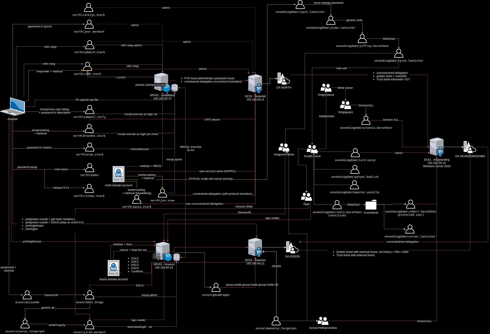

# GOAD

- LAB Content 


## Servers
This lab is actually composed of five virtual machines:
- **kingslanding** : DC01  running on Windows Server 2019 (with windefender enabled by default)
- **winterfell**   : DC02  running on Windows Server 2019 (with windefender enabled by default)
- **castelblack**  : SRV02 running on Windows Server 2019 (with windefender **disabled** by default)
- **meereen**      : DC03  running on Windows Server 2016 (with windefender enabled by default)
- **braavos**      : SRV03 running on Windows Server 2016 (with windefender enabled by default)

## domain : north.sevenkingdoms.local
- **winterfell**     : DC01
- **castelblack**    : SRV02 : MSSQL / IIS

## domain : sevenkingdoms.local
- **kingslanding**   : DC02
- **castelrock**     : SRV01 (disabled due to resources reasons)

## domain : essos.local
- **braavos**        : DC03
- **meeren**         : SRV03 : MSSQL / ADCS

The lab setup is automated using vagrant and ansible automation tools.
You can change the vm version in the Vagrantfile according to Stefan Scherer vagrant repository : https://app.vagrantup.com/StefanScherer


## Users/Groups and associated vulnerabilites/scenarios

- You can find a lot of the available scenarios on [https://mayfly277.github.io/categories/ad/](https://mayfly277.github.io/categories/ad/)

- Graph of some scenarios is available here :


NORTH.SEVENKINGDOMS.LOCAL
- STARKS:              RDP on WINTERFELL AND CASTELBLACK
  - arya.stark:        Execute as user on mssql, pass on all share
  - eddard.stark:      DOMAIN ADMIN NORTH/ (bot 5min) LLMRN request to do NTLM relay with responder
  - catelyn.stark:     
  - robb.stark:        bot (3min) RESPONDER LLMR / lsass present user
  - sansa.stark:       keywalking password / unconstrained delegation
  - brandon.stark:     ASREP_ROASTING
  - rickon.stark:      pass spray WinterYYYY
  - jon.snow:          mssql admin / KERBEROASTING / mssql trusted link
  - hodor:             PASSWORD SPRAY (user=password)
- NIGHT WATCH:         RDP on CASTELBLACK
  - samwell.tarly:     Password in ldap description / mssql execute as login
                       GPO abuse (Edit Settings on "STARKWALLPAPER" GPO)
  - jon.snow:          (see starks)
  - jeor.mormont:      (see mormont)
- MORMONT:             RDP on CASTELBLACK
  - jeor.mormont:      Admin castelblack, pass in sysvol script
- AcrossTheSea :       cross forest group

SEVENKINGDOMS.LOCAL
- LANISTERS
  - tywin.lannister:   ACE forcechangepassword on jaime.lanister, password on sysvol cyphered
  - jaime.lannister:   ACE genericwrite-on-user joffrey.baratheon
  - tyron.lannister:   ACE self membership on small council
  - cersei.lannister:  DOMAIN ADMIN SEVENKINGDOMS
- BARATHEON:           RDP on KINGSLANDING
  - robert.baratheon:  DOMAIN ADMIN SEVENKINGDOMS, protected user
  - joffrey.baratheon: ACE Write DACL on tyron.lannister
  - renly.baratheon:   WriteDACL on container, sensitive user
  - stannis.baratheon: ACE genericall-on-computer kingslanding 
- SMALL COUNCIL :      ACE add Member to group dragon stone / RDP on KINGSLANDING
  - petyer.baelish:    
  - lord.varys:        ACE genericall-on-group Domain Admins and sdholder
  - maester.pycelle:   
- DRAGONSTONE :        ACE Write Owner on group KINGSGUARD
- KINGSGUARD :         ACE generic all on user stannis.baratheon
- AccorsTheNarrowSea:       cross forest group

ESSOS.LOCAL
- TARGERYEN
  - missande :          ASREP roasting, generic all on khal
  - daenerys.targaryen: DOMAIN ADMIN ESSOS
  - viserys.targaryen:  ACE write property on jorah.mormont
  - jorah.mormont:      mssql execute as login / mssql trusted link / Read LAPS Password
- DOTHRAKI
  - khal.drogo:         mssql admin / GenericAll on viserys (shadow credentials) / GenericAll on ECS4
- DragonsFriends:       cross forest group
- Spys:                 cross forest group / Read LAPS password  / ACL generic all jorah.mormont

## Computers Users and group permissions

- SEVENKINGDOMS
  - DC01 : kingslanding.sevenkingdoms.local (Windows Server 2019) (SEVENKINGDOMS DC)
    - Admins : robert.baratheon (U), cersei.lannister (U)
    - RDP: Small Council (G)

- NORTH
  - DC02 : winterfell.north.sevenkingdoms.local (Windows Server 2019) (NORTH DC)
    - Admins : eddard.stark (U), catelyn.stark (U), robb.stark (U)
    - RDP: Stark(G)

  - SRV02 : castelblack.essos.local (Windows Server 2019) (IIS, MSSQL, SMB share)
    - Admins: jeor.mormont (U)
    - RDP: Night Watch (G), Mormont (G), Stark (G)
    - IIS : allow asp upload, run as NT Authority/network
    - MSSQL:
      - admin : jon.snow
      - impersonate : 
        - execute as login : samwel.tarlly -> sa
        - execute as user : arya.stark -> dbo
      - link :
        - to braavos : jon.snow -> sa

- ESSOS
  - DC03  : meereen.essos.local (Windows Server 2016) (ESSOS DC)
    - Admins: daenerys.targaryen (U)
    - RDP: Targaryen (G)

  - SRV03 : braavos.essos.local (Windows Server 2016) (MSSQL, SMB share)
    - Admins: khal.drogo (U)
    - RDP: Dothraki (G)
    - MSSQL :
      - admin : khal.drogo
      - impersonate :
        - execute as login : jorah.mormont -> sa
      - link:
        - to castelblack: jorah.mormont -> sa

## Blueteam / ELK

- **elk** a kibana is configured on http://192.168.56.50:5601 to follow the lab events
- infos : log encyclopedia : https://www.ultimatewindowssecurity.com/securitylog/encyclopedia/
- the elk is not installed by default due to resources reasons. 

- prerequistes: 
- you need `sshpass` for the elk installation
```bash
sudo apt install sshpass
```
- Chocolatey is needed to use elk. To install it run:
```bash
ansible-galaxy collection install chocolatey.chocolatey 
```

- To install and start the elk play the following commands :
```bash
./goad.sh -t install -l GOAD -p virtualbox -m local -r elk.yml -e elk
#or
./goad.sh -t install -l GOAD -p vmware -m local -r elk.yml -e elk
```

 * -e : to add the elk in vagrantfile for the vagrant up
 * -r : to run only the elk.yml ansible script

If you want to only launch the elk.yml file without providing (vm creation), because your elk vm is already up do :
```bash
./goad.sh -t install -l GOAD -p virtualbox -m local -a -r elk.yml -e elk
#or
./goad.sh -t install -l GOAD -p vmware -m local -a -r elk.yml -e elk
```

If you want to do that by hand:
  1. run: `GOAD_VAGRANT_OPTIONS=elk vagrant up`

  2. launch the elk provisionning with the command :
  ```
  cd ansible
  ansible-playbook -i ../ad/GOAD/data/inventory -i ../ad/GOAD/providers/<your_provider>/inventory elk.yml
  ```

### V2 breaking changes
- If you previously install the v1 do not try to update as a lot of things have changed. Just drop your old lab and build the new one (you will not regret it)
- Chocolatey is no more used and basic tools like git or notepad++ are no more installed by default (as chocolatey regularly crash the install due to hitting rate on multiples builds)
- ELK is no more installed by default to save resources but you still can install it separately (see the blueteam/elk part)
- Dragonstone vm as disappear and there is no more DC replication in the lab to save resources
- Wintefell is now a domain controller for the subdomain north of the sevenkingdoms.local domain

