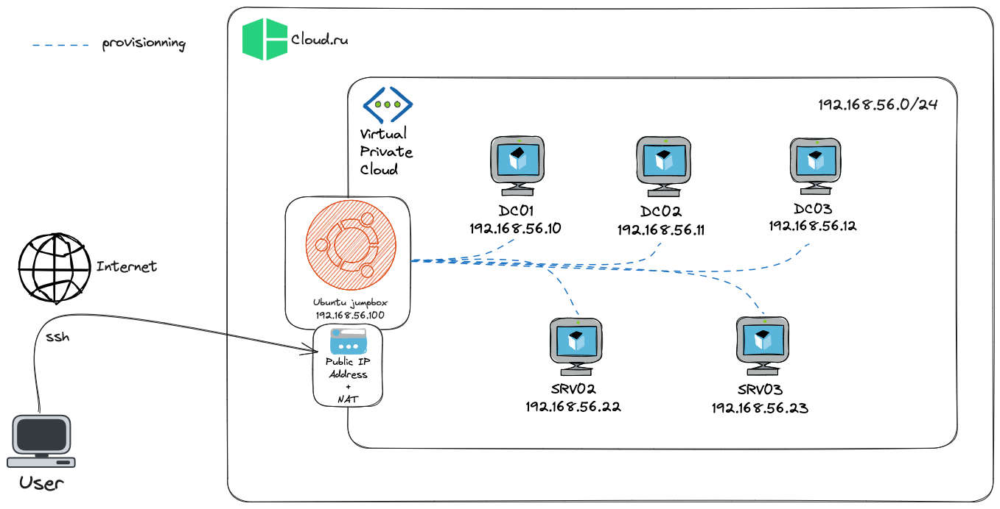
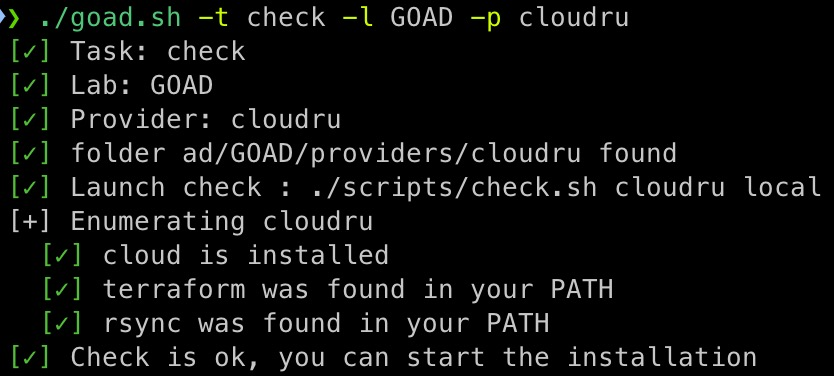

# Cloud.ru setup


<div align="center">
  
  
  
</div>



## Prerequisites

- [Terraform](https://www.terraform.io/downloads.html)
- [Cloud.ru CLI](https://cloud.ru/docs/cloud-cli/ug/topics/guides__install-cli.html)

## Cloud.ru configuration

1. [Create an IAM](https://cloud.ru/docs/obs/ug/topics/guides__create-access-keys.html) user and save its `Access Key` and `Secret Key`.
2. You need to login to Cloud with the CLI to use start, stop and restart commands.
```bash
cloud configure
```

## Automatic installation

```bash
# check prerequisites
./goad.sh -t check -l GOAD -p cloudru
# Install
SBC_ACCESS_KEY="AK" SBC_SECRET_KEY="SK" ./goad.sh -t install -l SCCM -p cloudru
```

> Note: `AK` is an `Access Key` and `SK` is a `Secret Key` of IAM user.



## Manual installation

### Build the infrastructure with Terraform.

1. Initialize Terraform

```bash
cd ad/GOAD/providers/cloudru/terraform
export SBC_ACCESS_KEY="AK"
export SBC_SECRET_KEY="SK"
terraform init
```

> Note: `AK` is an `Access Key` and `SK` is a `Secret Key` of IAM user and will be used for next steps.

2. Generate the terraform plan with the password

```bash
terraform plan -out tfplan
```

> Note: The plan is useful to check if the terraform configuration is correct

3. Apply the terraform plan

```bash
terraform apply tfplan
```

> Note: The terraform apply command will take a few minutes to complete

At the end of the terraform apply, the output will show the public ip of the Ubuntu VM. This VM will be used to run the ansible playbook to provision the Windows VM.

### Windows VM provisionning with Ansible
0. Rsync source on Ubuntu VM

```bash
cd ../../../../../ # to the repository root folder
CURRENT_DIR="$(cd "$(dirname "${BASH_SOURCE[0]}")" && pwd)"
rsync -a --exclude-from='.gitignore' -e "ssh -i $CURRENT_DIR/ad/GOAD/providers/cloudru/ssh_keys/ubuntu-jumpbox.pem" "$CURRENT_DIR/" root@$public_ip:~/GOAD/
```


1. Run the setup.sh script to install Ansible and download GOAD on the Ubuntu VM

```bash
ssh -i ad/GOAD/providers/cloudru/ssh_keys/ubuntu-jumpbox.pem root@<ubuntu-jumpbox-ip> 'bash -s' < scripts/setup_ubuntu_jumpbox.sh
```

> Note: To get the public ip of the Ubuntu VM, you can run `terraform output` in the terraform directory

2. Connect to the Ubuntu VM

```bash
ssh -i ssh_keys/ubuntu-jumpbox.pem root@<ubuntu-jumpbox-ip>
```

3. Run the playbook to provision the Windows VM

```bash
cd ansible
export ANSIBLE_COMMAND="ansible-playbook -i ../ad/GOAD/data/inventory -i ../ad/GOAD/providers/cloudru/inventory"
../scripts/provisionning.sh
```

- Details on the provisioning process are here: [provisioning.md](./provisioning.md)

## Tips

- To connect to the Windows VM, you can use proxychains and xfreerdp through the Ubuntu VM

```bash
ssh -i ssh_keys/ubuntu-jumpbox.pem root@<ubuntu_public_ip> -D 1080
proxychains xfreerdp /u:<login> /p:<password> /v:<windows_private_ip> +clipboard /dynamic-resolution /cert-ignore
```

- To download windows10 while SCCM lab provisioning, replace `win10_iso_url` in `ansible/roles/sccm/pxe/defaults/main.yml` with non-official url (e.g. with archive.org `https://ia801408.us.archive.org/14/items/Windows10Enterprise22H2Evaluation/19045.2006.220908-0225.22h2_release_svc_refresh_CLIENTENTERPRISEEVAL_OEMRET_x64FRE_en-us.iso`)
