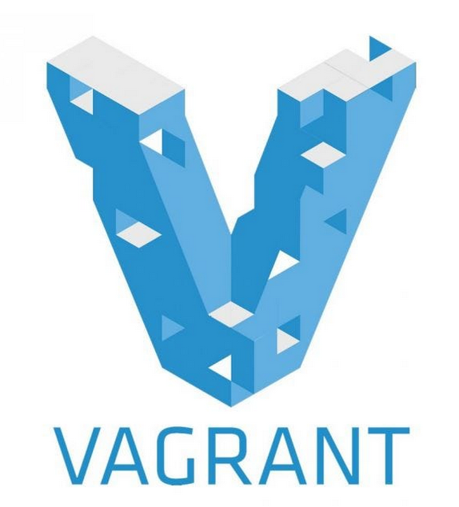

# Virtualbox setup

<div align="center">
  
  
  
</div>

## Prerequisites

- Providing
  - [Virtualbox](https://www.virtualbox.org/)
  - [Vagrant](https://developer.hashicorp.com/vagrant/docs)
  - Vagrant plugins:
    - vagrant-reload

- Provisioning with python
  - Python3 (>=3.8)
  - [ansible-core==2.12.6](https://docs.ansible.com/ansible/latest/index.html)
  - pywinrm

- Or provisioning With Docker
  - [Docker](https://www.docker.com/)


## check dependencies

- If you run ansible locally

```bash
./goad.sh -t check -l GOAD -p virtualbox -m local
```

- If you run ansible with docker

```bash
./goad.sh -t check -l GOAD -p virtualbox -m docker
```

## Install dependencies

> If the check is not ok you will have to install the dependencies (no automatic install is provided as it depend of your package manager and distribution). Here some install command lines are given for ubuntu.

### Install Virtualbox

- **virtualbox** actually the vms are provided to be run on virtualbox so you need a working virtualbox environment on your computer.
- This is obvious but yes you need to first install it on your hosts if you want to use it. (on ubuntu `sudo apt install virtualbox` will do the work)

```bash
sudo apt install virtualbox
```

### Install Vagrant

- **vagrant** from their official site [vagrant](https://developer.hashicorp.com/vagrant/downloads). __The version you can install through your favorite package manager (apt, yum, ...) is probably not the latest one__.
- Install vagrant plugin vbguest if you want the guest addition: `vagrant plugin install vagrant-vbguest` (not mandatory)
- Vagrant installation is well describe in [the official vagrant page](https://developer.hashicorp.com/vagrant/downloads) (tests are ok on 2.3.4)
- Some github issues indicate vagrant got some issue on some version and work well with 2.2.19 (`apt install vagrant=2.2.19`)

```bash
wget -O- https://apt.releases.hashicorp.com/gpg | gpg --dearmor | sudo tee /usr/share/keyrings/hashicorp-archive-keyring.gpg
echo "deb [signed-by=/usr/share/keyrings/hashicorp-archive-keyring.gpg] https://apt.releases.hashicorp.com $(lsb_release -cs) main" | sudo tee /etc/apt/sources.list.d/hashicorp.list
sudo apt update && sudo apt install vagrant
```

- on some recent versions (ubuntu 23.04), you should consider run also:
```bash
gem install winrm winrm-fs winrm-elevated
```

### Install docker

- If you want to run the ansible install from docker and don't install all the python dependencies just [install docker](https://docs.docker.com/engine/install/)

### Or Install Ansible locally

- If you want to play ansible from your host or a linux vm you should launch the following commands :

- *Create a python >= 3.8 virtualenv*

```bash
sudo apt install git
git clone git@github.com:Orange-Cyberdefense/GOAD.git
cd GOAD/ansible
sudo apt install python3.8-venv
python3.8 -m virtualenv .venv
source .venv/bin/activate
```

- Install ansible and pywinrm in the .venv
  - **ansible** following the extensive guide on their website [ansible](https://docs.ansible.com/ansible/latest/installation_guide/intro_installation.html).
  - **Tested with ansible-core (2.12)**
  - **pywinrm** be sure you got the pywinrm package installed

```
python3 -m pip install --upgrade pip
python3 -m pip install ansible-core==2.12.6
python3 -m pip install pywinrm
```

- Install all the ansible-galaxy requirements
  - **ansible windows**
  - **ansible community.windows**
  - **ansible chocolatey** (not needed anymore)
  - **ansible community.general**
```
ansible-galaxy install -r ansible/requirements.yml
```

## Install

### Launch installation automatically

- This will launch vagrant up and the ansible playbooks
- If you run ansible locally
```bash
./goad.sh -t install -l GOAD -p virtualbox -m local
```

- If you run ansible on docker
```bash
./goad.sh -t install -l GOAD -p virtualbox  -m docker
```

### Launch installation manually

### Create the vms

- To create the VMs just run 

```bash
cd ad/GOAD/providers/virtualbox
vagrant up
```

- At the end of the vagrantup you should have the vms created and running, like this :


- Adapter 1 is set up as NAT (used to internet access during the provisioning)
- Adapter 2 is set up as host only adapter on the network 192.168.56.1/24


### Launch provisioning with Docker

- launch the provision script (launch ansible with failover on errors)

```bash
sudo docker run -ti --rm --network host -h goadansible -v $(pwd):/goad -w /goad/ansible goadansible /bin/bash -c "ANSIBLE_COMMAND='ansible-playbook -i ../ad/GOAD/data/inventory -i ../ad/GOAD/providers/virtualbox/inventory' ../scripts/provisionning.sh"
```

- or launch ansible from docker directly

```bash
sudo docker run -ti --rm --network host -h goadansible -v $(pwd):/goad -w /goad/ansible goadansible ansible-playbook -i ../ad/GOAD/data/inventory -i ../ad/GOAD/providers/virtualbox/inventory main.yml
```

### Launch provisioning with Ansible

- launch the provision script (launch ansible with failover on errors)

```bash
cd ansible
export ANSIBLE_COMMAND="ansible-playbook -i ../ad/GOAD/data/inventory -i ../ad/GOAD/providers/virtualbox/inventory"
../scripts/provisionning.sh
```

- or launch ansible directly

```bash
cd ansible/
ansible-playbook -i ../ad/GOAD/data/inventory -i ../ad/GOAD/providers/virtualbox/inventory main.yml
```

- Details on the provisioning process are here : [provisioning.md](./provisioning.md)
