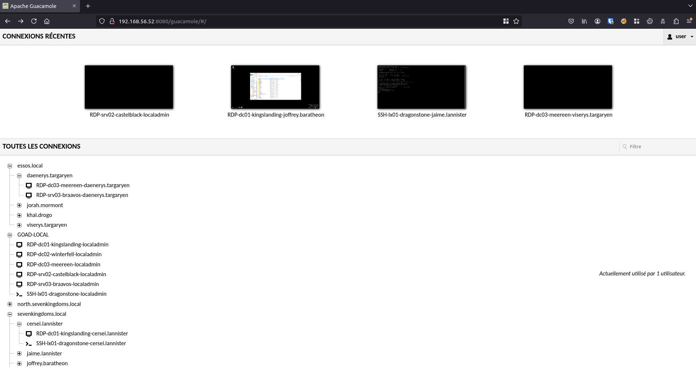

# guacamole

- Extension name : `guacamole`
- Description : Add a linux ubuntu 22.4 with guacamole ()
- Compatibility  : any
- Providers : virtualbox/azure/vmware/aws/ludus

- Add a machine  : {{lab_name}}-GUACAMOLE (ip_range.52)

## Info

Connect to http://(ip_range).52:8080/guacamole

And enjoy quick access to your lab :)




## Prerequisites

- Edit the file `/guacamole.yml` to change password to use and define users

- On ludus prepare template :
```
ludus templates add -d ubuntu-22.04-x64-server
ludus templates build
```

- If you get an ansible error on provisioning saying "missing role..." maybe you need to relaunch ansible-galaxy requirements install first
```bash
source ~/.goad/.venv/activate
cd ansible
# python <3.11
ansible-galaxy install -r requirements.yml
# python => 3.11
ansible-galaxy install -r requirements_311.yml
```

## Installation

- select your instance
```
load <instance_id>
```

- install the guacamole extension
```
install_extension guacamole
```

- if something goes wrong and you just need to relaunch the provision to add new users
```
provision_extension guacamole
```
