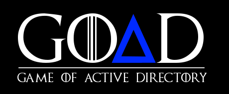

#

Welcome to [GOAD](https://github.com/Orange-Cyberdefense/GOAD/) documentation !

Game Of Active Directory is a free pentest active directory LAB(s) project (1).
{ .annotate }

1.  GOAD is free if you use your own computer, obviously we will not pay your electricity bill and your cloud provider invoice ;)

The purpose of this tool is to give pentesters a vulnerable Active directory environment ready to use to practice usual attack techniques.
The idea behind this project is to give you an environment where you can try and train your pentest skills without having the pain to build all by yourself.
This repository was build for pentest practice :slight_smile:

!!! note
    GOAD main labs (GOAD/GOAD-Light/SCCM) are not pro labs environments (like those you can find on HTB). Theses labs give you an environment to practice a lot of vulnerability and missconfig exploitations. Sure you can use them like pro labs, but it will certainly be too easy due to the number of vulns. Consider more GOAD like a DVWA but for Active Directory. If you want a chall deploy the lab NHA.

!!! warning
    This lab is extremely vulnerable, do not reuse recipe to build your production environment and do not deploy this environment on internet without isolation (this is a recommendation, use it as your own risk).

!!! info "Windows Licenses"
    This lab use free windows VM only (180 days). After that delay enter a license on each server or rebuild all the lab (may be it's time for an update ;))

!!! example ""
    **:heart: Sponsor** 
    This lab is created and maintained mainly by his creator (Cyril Servières a.k.a @m4yfly) on personal time (~80% personal time / ~20% at Orange Cyberdefense).
    If you like it maybe consider sponsoring me : [https://github.com/sponsors/Mayfly277](https://github.com/sponsors/Mayfly277)