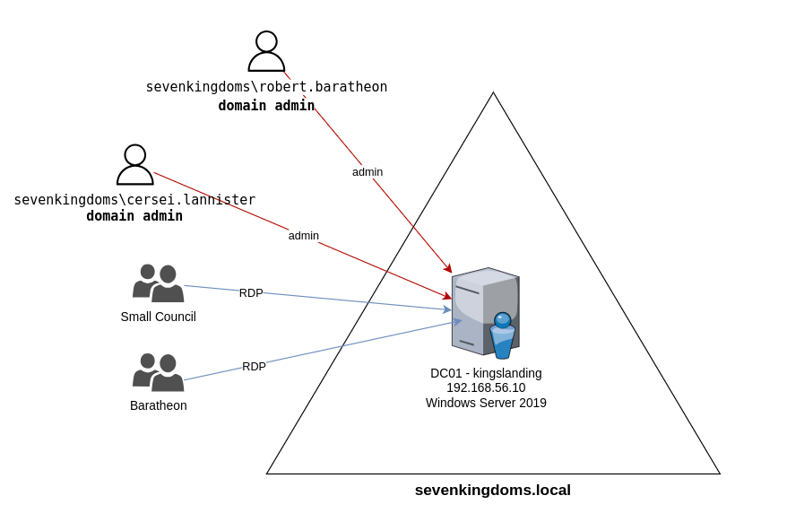

# GOAD-Mini

This is a minimalist version of goad with only sevenkingdoms.lab domain. This lab was build for a minimalist base to do test and try extensions.

## Servers
**domain : sevenkingdoms.local**
- **kingslanding** : DC01  running on Windows Server 2019 (with windefender enabled by default)

## Users/Groups and associated vulnerabilites/scenarios

**SEVENKINGDOMS.LOCAL**

- LANISTERS
    - tywin.lannister:   ACL forcechangepassword on jaime.lanister
    - jaime.lannister:   ACL genericwrite-on-user joffrey.baratheon
    - tyron.lannister:   ACL self-self-membership-on-group Small Council
    - cersei.lannister:  DOMAIN ADMIN SEVENKINGDOMS
- BARATHEON:           RDP on KINGSLANDING
    - robert.baratheon:  DOMAIN ADMIN SEVENKINGDOMS
    - joffrey.baratheon: ACL Write DACL on tyron.lannister
    - renly.baratheon:
    - stannis.baratheon: ACL genericall-on-computer kingslanding / ACL writeproperty-self-membership Domain Admins
- SMALL COUNCIL :      ACL add Member to group dragon stone / RDP on KINGSLANDING
    - petyer.baelish:    ACL writeproperty-on-group Domain Admins
    - lord.varys:        ACL genericall-on-group Domain Admins / Acrossthenarrossea
    - maester.pycelle:   ACL write owner on group Domain Admins
- DRAGONSTONE :        ACL Write Owner on KINGSGUARD
- KINGSGUARD :         ACL generic all on user stannis.baratheon
- AccorsTheNarrowSea:       cross forest group

## Computers Users and group permissions

- SEVENKINGDOMS
    - DC01 : kingslanding.sevenkingdoms.local (Windows Server 2019) (SEVENKINGDOMS DC)
        - Admins : robert.baratheon (U), cersei.lannister (U)
        - RDP: Small Council (G)
