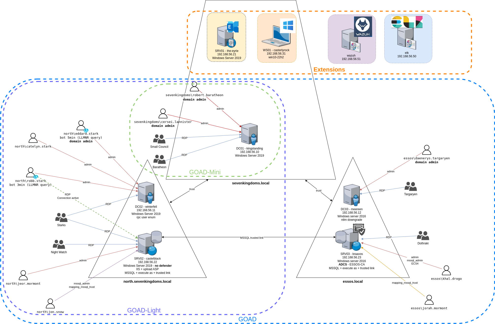

# Labs

- Practice lab(s) :
    - GOAD familly :
        - [GOAD](GOAD.md) : 5 vms, 2 forests, 3 domains (full goad lab)
        - [GOAD-Light](GOAD-Light.md) : 3 vms, 1 forest, 2 domains (smaller goad lab for those with a smaller pc)
        - [GOAD-Mini](GOAD-Mini.md) : 1 vm, 1 domains (only sevenkingdoms.local, minimalist lab)

        
   
    - [SCCM](SCCM.md) : 4 vms, 1 forest, 1 domain, with microsoft configuration manager installed
    

- Challenge lab :
    - [NHA](NHA.md) : A challenge with 5 vms and 2 domains. no schema provided, you will have to find out how break it.

- POC lab :
    - [MINILAB](MINILAB.md): 2 vms, 1 forest, 1 domain (basic lab with one DC (windows server 2019) and one Workstation (windows 10))
