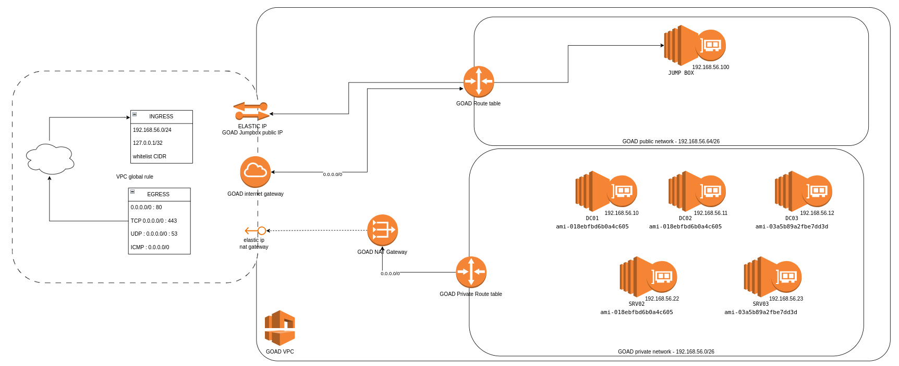

# :simple-amazon: Aws

!!! success "Thanks!"
    Thx to @ArnC_CarN for the initial work on the aws provider

<div align="center">
  
  
  
</div>

The architecture is quite the same than the Azure deployment.



!!! Warning
    LLMNR, NBTNS and other poisoning network attacks will not work in aws environment.
    Only network coerce attacks will work.

## Prerequisites

- [Terraform](https://www.terraform.io/downloads.html)
- [AWS CLI](https://aws.amazon.com/cli/?nc1=h_ls)

## AWS configuration

You need to configre AWS cli. Use a key with enough privileges on the tenant.

```bash
aws configure
```

- Create an aws access key and secret for goad usage
    - Go to IAM > User > your user > Security credentials
    - Click the Create access key button
    - Create a group "[goad]" in credentials file ~/.aws/credentials
        ```
        [goad]
        aws_access_key_id = changeme
        aws_secret_access_key = changeme
        ```
    - Be sure to chmod 400 the file

    !!! warning "credentials in plain text"
        Storing credentials in plain text is always a bad idea, but aws cli work like that be sure to restrain the right access to this file

## Goad configuration

- The goad configuration file as some options for aws:

```
# ~/.goad/goad.ini
...
[aws]
aws_region = eu-west-3
aws_zone = eu-west-3c
```

- If you want to use a different region and zone you can modify it.


## Installation

```bash
# check prerequisites
./goad.sh -t check -l GOAD -p aws
# Install
./goad.sh -t install -l GOAD -p aws
```

or from the interactive console :

```bash
GOAD/aws/remote/192.168.56.X > install
```

## start/stop/status

- You can see the status of the lab with the command `status`
- You can also start and stop the lab with the command `start` and `stop`


## VMs ami

- The vm used for goad are defined in the lab terraform file : `ad/<lab>/providers/aws/windows.tf`
- This file is containing information about each vm in use

```
"dc01" = {
  name               = "dc01"
  domain             = "sevenkingdoms.local"
  windows_sku        = "2019-Datacenter"
  ami                = "ami-018ebfbd6b0a4c605"
  instance_type      = "t2.medium"
  private_ip_address = "{{ip_range}}.10"
  password           = "8dCT-DJjgScp"
}
```

## How it works ?

- On the installation goad script will create a folder into `goad/workspaces/<instance_folder>`
- This folder will contain the terraform scripts and some of the ansible inventories
- Goad will create the cloud infrastructure with terraform.
- The lab is created (not provisioned yet) and a "jumpbox" vm is also created
- Next the needed sources will be pushed to the jumpbox using `ssh` and `rsync`
- The jumpbox ssh_key is stored on `goad/workspaces/<instance_folder>/ssh_keys`
- The jumpbox is prepared to run ansible
- The provisioning is launch with ssh remotely on the jumpbox

## Install step by step

```bash
GOAD/aws/remote/192.168.56.X > create_empty # create empty instance
GOAD/aws/remote/192.168.56.X > load <instance_id>
GOAD/aws/remote/192.168.56.X (<instance_id>) > provide # play terraform
GOAD/aws/remote/192.168.56.X (<instance_id>) > sync_source_jumpbox # sync jumpbox source
GOAD/aws/remote/192.168.56.X (<instance_id>) > prepare_jumpbox # install dependencies on jumpbox
GOAD/aws/remote/192.168.56.X (<instance_id>) > provision_lab # run ansible
```

## Tips

- To connect to the jumpbox VM you can use `ssh_jumpbox` in the goad interactive console
- To setup a socks proxy you can use `ssh_jumpbox_proxy <proxy_port>` in the goad interactive console
- All aws elements are tagged with `<lab_name>-<lab_instance_id>`