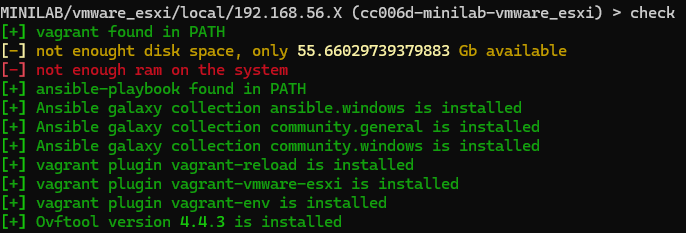
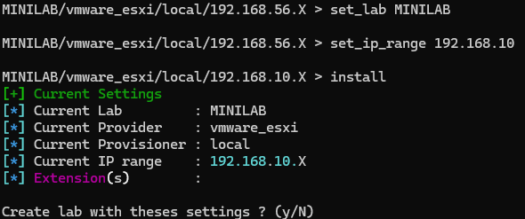

# :simple-vmware: Vmware ESXi

!!! success "Thanks!"
    Thanks to [fsacer](https://github.com/fsacer) and  [viris](https://github.com/viris) for the pr [330](https://github.com/Orange-Cyberdefense/GOAD/pull/330) for vmware esxi provider support

<div align="center">
  
  
  
</div>

## Prerequisites

- Providing
  - [VMWare ESXi](https://www.vmware.com/products/esxi-and-esx.html) - [no longer free](https://kb.vmware.com/s/article/2107518)
  - [Vagrant](https://developer.hashicorp.com/vagrant/docs)
  - Vagrant plugins:
    - vagrant-reload
    - vagrant-vmware-esxi
    - vagrant-env
    - on some distribution also the vagrant plugins :
      - winrm
      - winrm-fs
      - winrm-elevated
  - ovftool (https://developer.broadcom.com/tools/open-virtualization-format-ovf-tool/latest)

- Provisioning with python
  - Python3 (>=3.8)
  - [ansible-core==2.12.6](https://docs.ansible.com/ansible/latest/index.html)
  - pywinrm

- Or provisioning With Docker
  - [Docker](https://www.docker.com/)

## check dependencies

```bash
./goad.sh -p vmware_esxi
GOAD/vmware_esxi/local/192.168.56.X > check
```



!!! info
    If there is some missing dependencies goes to the [installation](../installation/index.md) chapter and follow the guide according to your os.

!!! note
    check give mandatory dependencies in red and non mandatory in yellow (but you should be compliant with them too depending one your operating system)

## Install

- To install run the goad script and launch install or use the goad script arguments

```bash
./goad.sh -p vmware_esxi
GOAD/vmware_esxi/local/192.168.56.X > set_lab <lab>  # here choose the lab you want (GOAD/GOAD-Light/NHA/SCCM)
GOAD/vmware_esxi/local/192.168.56.X > set_ip_range <ip_range>  # here choose the  ip range you want to use ex: 192.168.56 (only the first three digits)
GOAD/vmware_esxi/local/192.168.56.X > install
```



- or all in command line with arguments

```bash
./goad.sh -t install -p vmware_esxi -l <lab> -ip <ip_range_to_use>
```