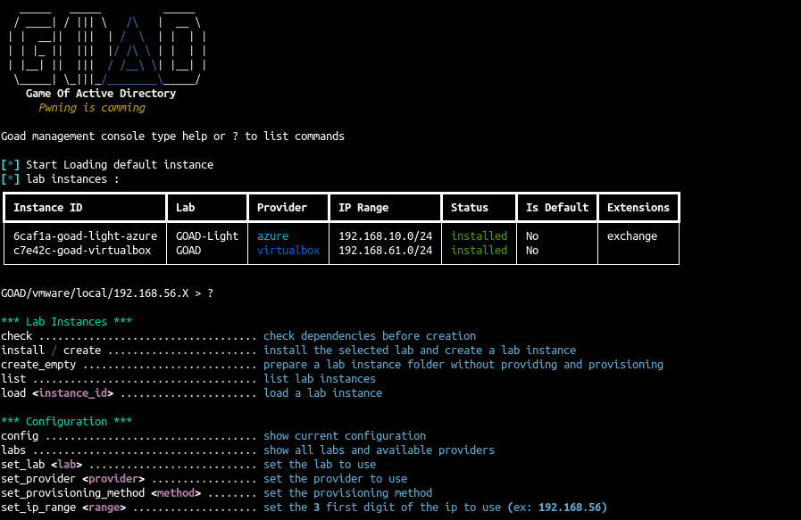
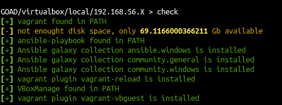
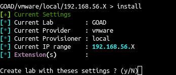
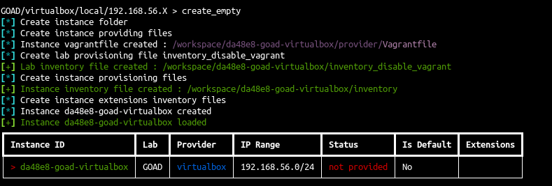
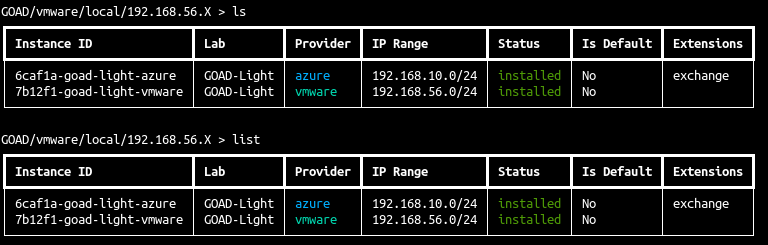
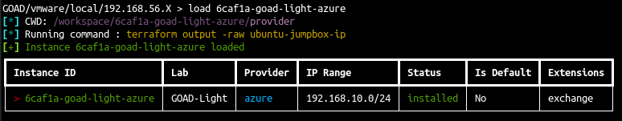
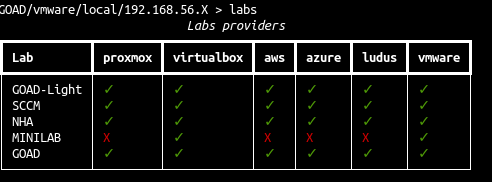

# :material-console-line: GOAD interactive mode

Launch goad interactive mode



## Enter interactive mode

To enter interactive mode just launch goad without the `-t` parameter

``` bash
./goad.sh
```

## No lab instance selected

```
*** Lab Instances ***
check ................................... check dependencies before creation
install / create ........................ install the selected lab and create a lab instance
create_empty ............................ prepare a lab instance folder without providing and provisioning
list .................................... list lab instances
load <instance_id> ...................... load a lab instance

*** Configuration ***
config .................................. show current configuration
labs .................................... show all labs and available providers
set_lab <lab> ........................... set the lab to use
set_provider <provider> ................. set the provider to use
set_provisioning_method <method> ........ set the provisioning method
set_ip_range <range> .................... set the 3 first digit of the ip to use (ex: 192.168.56)
```

### check

Will check the lab dependencies

```
check
```



### install

Install the lab with the current select `config`

```
install
```

- This will:
    - create an instance folder into workspaces/
    - run vagrant/terraform/ludus depending on the provider to create the machines
    - synchronize source to jumpbox if provider is aws or azure
    - provision jumpbox if provider is aws or azure
    - run the ansible provisioning 



### create_empty

Create an empty instance folder (into the workspaces/ folder)

```
create_empty
```



### list

List instances

> alias : `ls`

```
list
```



### load

Select an instance by his name

> alias : `use`, `cd`

```
load <instance name>
```



### config

show current configuration

```
config
```


### labs

show available labs

```
labs
```




### set_lab

Choose the lab to use (GOAD/GOAD-Light/NHA/SCCM/MINILAB)

```
set_lab <lab_name>
```

### set_provider

Choose the provider to use (virtualbox/vmware/aws/azure/ludus/proxmox)

```
set_provider <lab_name>
```


### set_provisioning_method

Choose the provisioning method (local/runner/docker/remote) (most of the time you don't have to change it)

```
set_provisioning <provisioning_method>
```

- local : launch ansible with subprocess (default for vbox/vmware/proxmox/ludus)
- runner : launch ansible with ansible runner
- remote : launch ansible through ssh using jumpbox (default for azure/aws)
- docker : user the docker container to launch ansible (docker container must be built first `sudo docker build -t goadansible .`)

### set_ip_range

Set the ip range you want to use (Three first digit, example : 192.168.10)

```
set_ip_range <ip_range>
```


## Instance selected


```
*** Manage Lab instance commands ***
status .................................. show current status
start ................................... start lab
stop .................................... stop lab
destroy ................................. destroy lab

*** Manage one vm commands ***
start_vm <vm_name> ...................... start selected virtual machine
stop_vm <vm_name> ....................... stop selected virtual machine
restart_vm <vm_name> .................... restart selected virtual machine
destroy_vm <vm_name> .................... destroy selected virtual machine

*** Extensions ***
list_extensions ......................... list extensions
install_extension <extension> ........... install extension (providing + provisioning)
provision_extension <extension> ......... provision extension (provisioning only)

*** JumpBox ***
prepare_jumpbox ......................... install package on the jumpbox for provisioning
sync_source_jumpbox ..................... sync source of the jumpbox
ssh_jumpbox ............................. connect to jump box with ssh
ssh_jumpbox_proxy <proxy_port> .......... connect to jump box with ssh and start a socks proxy

*** Providing (Vagrant/Terrafom) ***
provide ................................. run only the providing (vagrant/terraform)

*** Provisioning (Ansible) ***
provision <playbook> .................... run specific ansible playbook
provision_lab ........................... run all the current lab ansible playbooks
provision_lab_from <playbook> ........... run all the current lab ansible playbooks from specific playbook to the end

*** Lab Instances ***
check ................................... check dependencies before creation
install ................................. install the current instance (provide + prepare_jumpbox + provision_lab
set_as_default .......................... set instance as default
update_instance_files ................... update lab instance files
list .................................... list lab instances
load <instance_id> ...................... load a lab instance

*** Configuration ***
config .................................. show current configuration
unload .................................. unload current instance
delete .................................. delete the currently selected lab instance
```

### status

Give the current lab status

```
status
```

### start

Start the current lab instance

```
start
```

### stop

Stop the current lab instance

```
stop
```

### destroy

!!! danger
    Destroy the current lab instance vms

```
destroy
```

### start_vm

Start a vm

```
start_vm <vm_name>
```

### stop_vm

Stop a vm

```
stop_vm <vm_name>
```

### restart_vm

Restart a vm (start and stop)

```
restart_vm <vm_name>
```

### destroy_vm

!!! danger
    Destroy a vm

```
destroy_vm <vm_name>
```

### list_extensions

List available extensions

```
list_extensions
```

### install_extension

Add an extension to the lab (providing + provisioning)

!!! warning
    An installed extension can't be deleted

```
install_extension <extension_name>
```

### provision_extension

Launch provisioning (ansible) for the extension

```
provision_extension <extension_name>
```

### prepare_jumpbox

Prepare jumpbox : run the preparation script on the jumpbox (install dependencies)

```
prepare_jumpbox
```

### sync_source_jumpbox

Rsync goad source with the jumpbox

```
sync_source_jumpbox
```

### ssh_jumpbox


SSH into the jumpbox

```
ssh_jumpbox
```

### ssh_jumpbox_proxy

SSH into the jumpbox with a socks proxy option (-D)

```
ssh_jumpbox_proxy <socks_proxy_port>
```

### provide

Launch providing (machine creation)

```
provide
```

### provision

Launch specific playbook  (use playbook in ansible/ folder) 

```
provision <playbook.yml>
```

### provision_lab

Launch all the lab provisioning  (install labs on machines with ansible)

```
provision_lab
```

### provision_lab_from

Launch the lab provisioning from a specific playbook (use playbook in ansible/ folder)

!!! tip
    useful if the install crash to not redo all the provisioning

```
provision_lab_from <playbook.yml>
```

### check

Launch the check (same as without instance)
```
check
```

### install

Launch the install (useful if you created an empty instance)
```
install
```

### set_as_defualt

Set the current instance as default (automatically loaded on goad start)
```
set_as_defualt
```

### update_instance_files

Recreate the files inside the workspace folder
```
update_instance_files
```

### list

List instances

> alias : `ls`

```
list
```

### load

Select an instance by his name (here change the current instance)

> alias : `use`, `cd`

```
load <instance name>
```

### config

Show current configuration
```
config
```

### unload

Unload the instance (alias `cd ..`)
```
unload
```

### delete

!!! danger
    delete the current instance lab and vms

```
delete
```