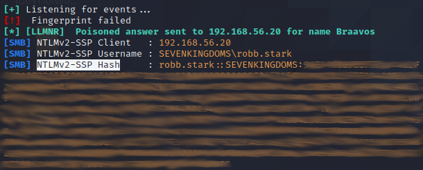

# LLMNR/NT-BS Poisoning and Relay with Responder

## Description

Link-Local Multicast Name Resolution (LLMNR) is a windows component which acts as a host discovery/identification method in windows systems. LLMNR and NBT-NS (NetBios Name System)are used as an alternative for Domain Name System (DNS) and can identify other hosts in same local link or network. In Active Directory environments we can see very often that, LLMNR is enabled and being used widely.

But this method of host resolution has severe security impact, as when a non-existing host is searched using LLMNR method, it broadcasts the search request to every system connected to the local network. As a result, if any of the systems in local network is somehow compromised by an attacker, it also receives the host search query and can send a response to the victim (the system which initiated the host resolution query) that it knows the host and in turn ask for the password hash of the victim.

## Context

To perform this attack, the Lab has a feature (in roles/vulns/responder) that makes the Winterfell server performs a scheduled task as the user robb.stark every minute. This scheduled task tries to connect to a shared folder that doesn't exist. It will lead to a LLMNR/NT-BS poisoning vulnerability.

## Exploiting the vulnerability

You must have access to a computer connected to the lab network but don't need to be authenticated to the lab domain.
On Kali linux, responder package is already installed by default if not, you can find it [here](https://github.com/lgandx/Responder/).
Identify with ifconfig the network interface connected to the lab network (192.168.56.X) and use the following responder command :

	responder -I <interface> -v

After maximum 1 minute,  you should obtain the following event and answer :
  

Save the Net-NTLMv2 Hash of robb.stark in a text file and use hashcat to decrypt it :

	hashcat -m 5600 <hash text file> <wordlist>

You can also use JohnTheRipper :

	john <hash text file> -wordlist=<wordlist>

The password of robb.stark is included in the rockyou.txt wordlist, so you will easily find it by choosing it as the wordlist.

## Next steps

As you don't need credentials or to comprise a lab computer to perform this attack, it can be the first step of the domain attack.
With the password of robb.stark, you will be able to connect as a local administrator on Winterfell server and perform further exploitation.

