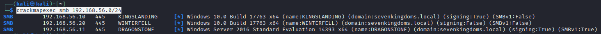
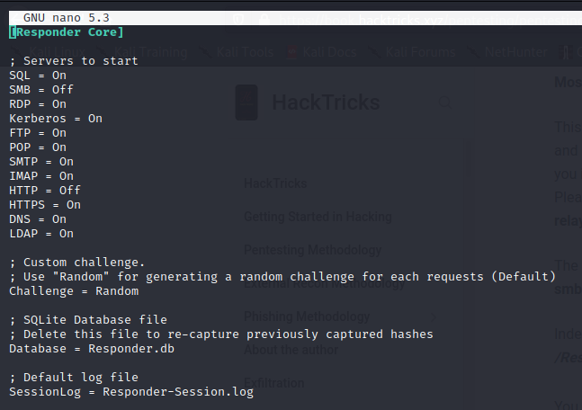
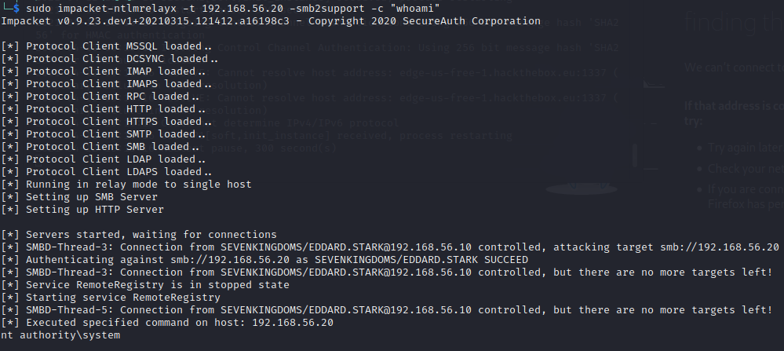
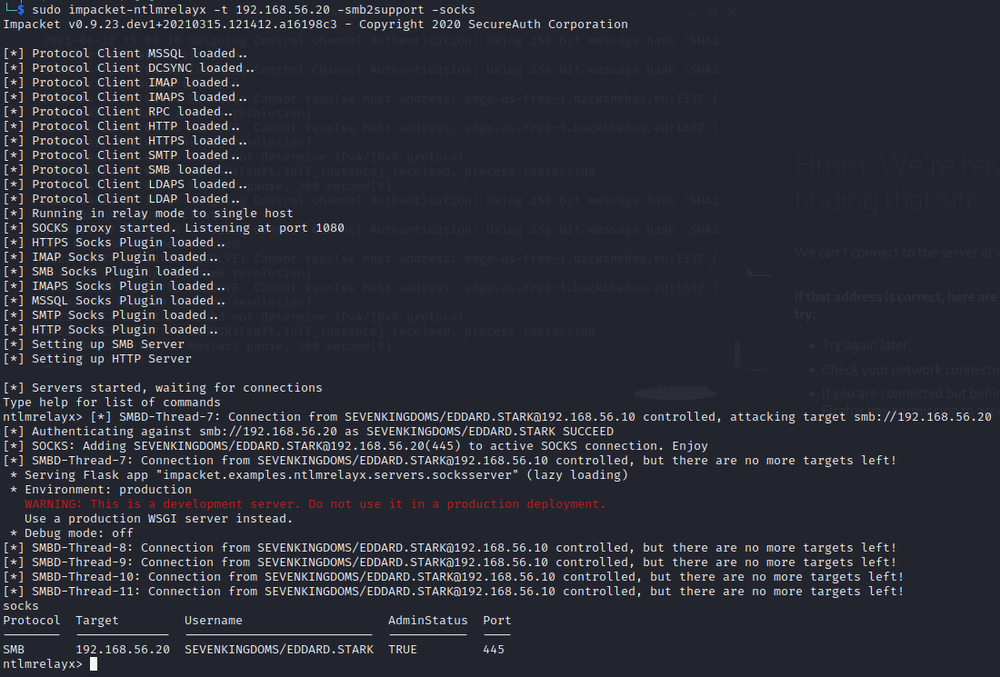
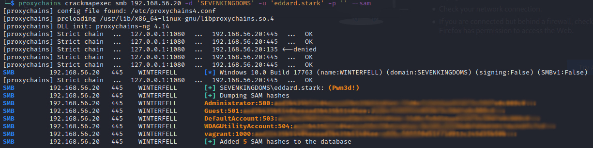

# NTLM Relay

## Description

The NTLM relay attack consists of using Responder in combination with a relay tool to automatically intercept connections and relay authentication hashes or Net-NTLMv2 hashes.

Net-NTLMv2 (or simply NTLM) is microsoft's challenge and response protocol. When authenticating to a server the user's hash followed by the server's challenge is used. With relaying hashes you simply take the NetNTLMv2 hash you collected and relay it to a one host or a set of hosts and hopefully the user(s) have administrator access. Then you can execute a command and even get an admin shell.

Here, you don't have to crack the hashes you get from Responder like in the [LLMNR/NT-BS Poisoning attack](https://gitlab.com/mayfly/ad-lab/-/blob/master/docs/scenarios/LLNMR_NTBS_poisoning_responder.md), you can directly relay them to other machines.

Since [MS08-068](https://www.rapid7.com/db/modules/exploit/windows/smb/smb_relay/) you cannot relay a Net-NTLM hash back to the same machine you got it from (e.g. the 'reflective' attack) unless you're performing a cross-protocol relay (which is an entirely different topic). However you can still relay the hash to vulnerable machines.

The only limit to this attack is SMB Signing, it needs to be disabled on the machine you're relaying too. With the exception of Windows Server OS's, all Windows operating systems have SMB Signing disabled by default.

## Context 

To perform this attack, the Lab has a feature (in roles/vulns/ntlm_relay) similar to the [LLMNR/NT-BS Poisoning attack](https://gitlab.com/mayfly/ad-lab/-/blob/master/docs/scenarios/LLNMR_NTBS_poisoning_responder.md) that makes the Kingslanding server performs a scheduled task as the user eddard.stark every 5 minutes. This scheduled task tries to connect to a shared folder that doesn't exist, this will allow us to make a NTLM relay attack. Winterfell is the only computer with SMB signing disabled so it's the only vulnerable target for the attack.

## Exploiting the vulnerability

You must have access to a computer connected to the lab network but don't need to be authenticated to the lab domain.
First of all, you can check which server on the domain has the SMB signing set to False with crackmapexec (installed by default on Kali Linux or available [here](https://github.com/byt3bl33d3r/CrackMapExec)) and the following command :

	cme smb 192.168.56.0/24

to directly list the hosts that don't require SMB signing in a file : 
	
	cme smb 192.168.1.0/24 --gen-relay-list output_file.txt

You will get the following display : 

Now, we will use the Responder (already installed by default on Kali if not, you can find it [here](https://github.com/lgandx/Responder/)) to answer to eddard.stark and make him believe our computer is a valid server. 
First, you have to disable SMB and HTTP features of the responder by editing the Responder configuration file, on Kali it's located here :

    /usr/share/responder/Responder.conf

Turn off the SMB and HTTP servers by changing 'On' to 'Off'

Identify with ifconfig the network interface connected to the lab network (192.168.56.X) and use the following responder command :

	responder -I <interface> -v

In the meantime, you have to use ntlmrelayx from the impacket collection (installed by default on Kali Linux or available [here](https://github.com/SecureAuthCorp/impacket)). We will make our computer ready to relay the eddard.stark Net-NTLMv2 hash as soon as the responder will receive and answer eddard.stark's connection.
To do that we launch ntlmrelayx with the target computer and the command we want to launch on the victim computer :

	impacket-ntlmrelayx -t <TARGET> -smb2support -c <COMMAND>

As the Responder caught the event, it will result in a relay on the target and the command will be executed :

If you want a stable connection relayed and not to be limited to one command per hash received, you can use the socks proxy of ntlmrelayx :

	impacket-ntlmrelayx -t <TARGET> -smb2support -socks

By entering "socks" in ntlmrelayx you can observe your connection by SOCKS proxy :

To use it, you will need proxychains* and crackmapexec with its options (-sam for example) :

	proxychains crackmapexec smb <TARGET> -d '<DOMAIN>' -u '<TARGET USER>' -p '' <CRACKMAPEXEC ARGUMENT>

\* By default, proxychains use the port 9050 (the default Tor configuration). If you are using Tor, leave this as it is. If you are not using Tor, change it to 1080 in the proxychains configuration file (located in /etc/proxychainsX.conf).

## Next steps

With this attack you can impersonate eddard.stark on Winterfell who is a domain admin without any domain footprints. It can be the first step of an attack that can leads to further domain exploitation like lateral movement with the obtained credentials (as all computers share the same Administrator password) and compromisation of the domain controllers. You can also perform the LLMNR/NT-BS Poisoning attack instead of the NTLM relay and try to crack the eddard.Stark's password. 

